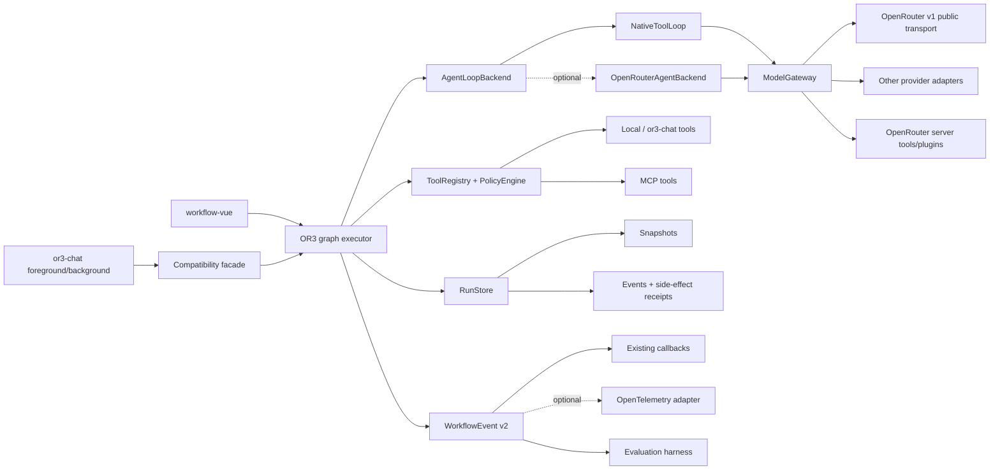

# Design

## Overview

The modernization introduces a provider-neutral model gateway beside the current `LLMProvider`, then moves the native agent loop, an optional `@openrouter/agent` loop, and future transports behind that gateway. Existing workflow documents, string outputs, callbacks, and constructors continue through adapters while `or3-chat` migrates from its SDK-v1 compatibility patch to an explicitly constructed provider. Typed values, tool policies, run persistence, and richer events are additive fields so the graph engine remains the source of truth.

The plan deliberately changes several points from the initial proposal:

- A structured-output feature is a typed result contract plus optional UI node/preset, not a second copy of the agent executor.
- OpenRouter server tools are remote capabilities attached to a model call. They are not directly executable workflow nodes; `openrouter:apply_patch` is also Responses-API-only.
- Model parallel-tool generation and local concurrent execution are separate policy decisions.
- Durable side effects require intent and receipt records. Checkpointing only after a wave cannot prevent duplicate external actions.
- A supervisor starts as a graph template/composite extension and must earn a dedicated primitive through evaluations.

The external basis is current OpenRouter documentation for [provider routing](https://openrouter.ai/docs/guides/routing/provider-selection), [model fallbacks](https://openrouter.ai/docs/guides/routing/model-fallbacks), [structured outputs](https://openrouter.ai/docs/guides/features/structured-outputs), [server tools](https://openrouter.ai/docs/guides/features/server-tools/overview), [router metadata](https://openrouter.ai/docs/guides/features/router-metadata), and the [`@openrouter/agent` migration](https://openrouter.ai/docs/agent-sdk/agent-migration). The durability model follows the useful distinction between per-step checkpoints and cross-run stores documented by [LangGraph persistence](https://docs.langchain.com/oss/javascript/langgraph/persistence). Telemetry remains exporter-neutral, following OpenTelemetry's guidance that libraries depend on the API while applications configure the SDK/exporter: [OpenTelemetry JavaScript instrumentation](https://opentelemetry.io/docs/languages/js/instrumentation/).

## Architecture



- **Compatibility facade (R1, R2, R3):** recognizes legacy `LLMProvider`, preserves `OpenRouterExecutionAdapter`, normalizes old tool definitions, and projects typed outputs back to strings.
- **ModelGateway (R2, R3, R4, R8):** owns provider-neutral request/result types, capability requirements, metadata normalization, and cancellation.
- **OpenRouterTransport (R3, R6):** uses only public SDK v1/API request surfaces, maps camelCase SDK fields at one boundary, and never discovers credentials through private fields.
- **AgentLoopBackend (R5, R6):** keeps the native loop as default and offers an optional OpenRouter Agent implementation through a lazy subpath/package.
- **ToolRegistry and PolicyEngine (R5, R6):** separates serializable descriptors from runtime implementations and decides approval, execution authority, idempotency, and concurrency.
- **TypedValueRuntime (R4):** validates structured results, preserves a deterministic string projection, and exposes typed values to opted-in downstream edges.
- **RunStore (R7):** combines append-only run events, queryable snapshots, and side-effect receipts without conflating them with long-term memory.
- **WorkflowEvent v2 and adapters (R8):** enriches the existing discriminated event union, keeps callbacks working, and allows an optional OpenTelemetry mapping.
- **EvaluationHarness (R8, R9):** runs saved cases against mocked or explicitly live providers and gates supervisor/backend promotion.
- **SupervisorTemplate (R9):** composes existing graph primitives and produces ordinary observable subflow execution.

## Components and Interfaces

### Provider-neutral gateway

```ts
export type NonEmptyModels = readonly [string, ...string[]];

export interface ModelRequest {
    models: NonEmptyModels;
    messages: ChatMessage[];
    generation?: {
        temperature?: number;
        maxOutputTokens?: number;
        reasoning?: ReasoningConfig;
        responseFormat?: StructuredOutputRequest;
    };
    routing?: ProviderRoutingPolicy;
    tools?: ModelToolDescriptor[];
    toolChoice?: ToolChoice;
    parallelToolCalls?: boolean;
    requiredCapabilities?: ModelCapability[];
    plugins?: ProviderPluginDescriptor[];
    onTextDelta?: (delta: string) => void;
    onReasoningDelta?: (delta: string) => void;
    signal?: AbortSignal;
    debug?: { includeRawResponse?: boolean };
}

export interface ModelCallResult {
    requestedModels: NonEmptyModels;
    actualModel?: string;
    provider?: string;
    assistantMessage: ChatMessage;
    content: string | null;
    structuredValue?: JsonValue;
    toolCalls?: ToolCallResult[];
    finishReason?: FinishReason;
    usage?: {
        inputTokens?: number;
        outputTokens?: number;
        reasoningTokens?: number;
        cachedTokens?: number;
        totalTokens?: number;
        costUsd?: number;
    };
    identifiers?: {
        requestId?: string;
        generationId?: string;
        upstreamId?: string;
    };
    timing?: {
        startedAt: number;
        completedAt: number;
        firstTokenMs?: number;
        totalMs: number;
    };
    annotations?: ProviderAnnotation[];
    raw?: { provider: string; value: unknown };
}

export interface ModelGateway {
    generate(request: ModelRequest): Promise<ModelCallResult>;
    getModelCapabilities(modelId: string): Promise<ModelCapabilities | null>;
}
```

`LLMProvider` remains exported. `LegacyLLMProviderGateway` converts the first item in `models` to the old positional `model`, passes supported options, and marks unsupported new options during preflight. `OpenRouterExecutionAdapter` accepts `OpenRouter | LLMProvider | ModelGateway` during the deprecation window, but internally stores only a `ModelGateway`.

### OpenRouter boundary

`OpenRouterModelGateway` receives explicit public configuration:

```ts
interface OpenRouterGatewayOptions {
    client: OpenRouterV1Client;
    requestOptions?: (signal?: AbortSignal) => PublicRequestOptions;
    metadata?: 'disabled' | 'enabled';
    debug?: boolean;
}
```

The implementation uses SDK v1 request nesting and model types only within `providers/openrouter/**`. Public model-catalog types move to OR3-owned structural types. Deprecated aliases preserve source compatibility for one minor release.

OpenRouter-specific mapping rules:

- `models` preserves priority.
- `routing.requireParameters` defaults to true for declared required capabilities.
- Latency/throughput thresholds are preferences, not hard exclusions; the UI wording must reflect that OpenRouter may use them as fallbacks.
- The actual model comes from the response; provider/request/latency details come from direct response metadata when present, router metadata when opted in, or an optional generation lookup. Missing details remain absent.
- Structured-output response healing is exposed only for non-streaming Chat Completions where OpenRouter supports it.
- Server tool descriptors include `transport: 'chat' | 'responses' | 'either'`; plugins use a separate descriptor type.

### Capability resolution

`CapabilityResolver` evaluates node requirements against:

1. The current `or3-chat`-populated model registry when fresh.
2. Provider-reported capability data.
3. Request-level `require_parameters` as the authoritative runtime guard.

The result is `supported | unsupported | unknown`, not a boolean. `unsupported` blocks; `unknown` warns and defers. A fallback chain is checked model by model so an unsupported fallback cannot silently weaken a strict schema/tool requirement.

### Structured values

```ts
interface StructuredOutputSpec {
    schemaId: string;
    schemaVersion: number;
    jsonSchema: Record<string, unknown>;
    strict: boolean;
    repair?: { maxAttempts: number; backend: 'retry' | 'response-healing' };
}

interface NodeExecutionResult {
    output: string;                 // existing stable projection
    value?: JsonValue;              // additive typed value
    valueSchema?: { id: string; version: number };
    nextNodes: string[];
    metadata?: Record<string, unknown>;
}
```

`SchemaRegistry` optionally associates `schemaId@version` with a Zod schema. Persisted workflows never contain a Zod instance. `JSON.stringify(value)` with stable key ordering is the default legacy string projection. `ExecutionContext.inputValue` and typed edge mappings are additive; old nodes continue receiving `context.input`.

A “Structured Agent” palette entry may be implemented as a configured `AgentNodeExtension` preset. A separate `SchemaValidationNodeExtension` is justified for validating data produced by tools or non-agent nodes.

### Typed tool capability

```ts
interface WorkflowTool<TInput = unknown, TOutput = unknown> {
    descriptor: {
        name: string;
        description?: string;
        inputSchema: Record<string, unknown>;
        outputSchema?: Record<string, unknown>;
        authority: 'host-client' | 'host-server' | 'mcp' | 'provider-server';
        sideEffect: 'none' | 'reversible' | 'destructive';
        approval: 'never' | 'policy' | 'always';
        parallelSafe: boolean;
        permissions?: string[];
    };
    parseInput?: (value: unknown) => TInput;
    execute?: (input: TInput, context: ToolExecutionContext) => Promise<TOutput>;
    idempotencyKey?: (
        input: TInput,
        context: Pick<ToolExecutionContext, 'runId' | 'nodeId' | 'callId'>
    ) => string;
}

interface ToolExecutionContext {
    runId: string;
    nodeId: string;
    callId: string;
    attempt: number;
    idempotencyKey?: string;
    signal: AbortSignal;
}
```

The model's `parallelToolCalls` flag is independent from `ToolExecutionPolicy.mode`. The policy engine may reduce a parallel batch to sequential execution, pause it for approval, or reject it. Legacy tools are adapted with `authority: 'host-client'` or host-selected authority, `sideEffect: 'none'` only when the host explicitly asserts it, `approval: 'policy'`, and `parallelSafe: false`.

Provider server tools have descriptors but no local `execute`; OpenRouter executes them inside the model request. MCP and `or3-chat` registries retain their own execution code behind adapters. This unifies inspection and events, not trust boundaries.

### Agent-loop backends

```ts
interface AgentLoopBackend {
    id: 'native' | 'openrouter-agent' | string;
    run(input: AgentLoopInput): Promise<AgentLoopResult>;
}
```

The native backend wraps `runValidatedToolLoop`. The optional OpenRouter backend lives in a lazy export such as `or3-workflow-core/openrouter-agent` or a small companion package so static clients do not load it. It translates `callModel`, typed tools, `stopWhen`, state, and approval APIs into OR3 events and checkpoints. It is not enabled until parity tests prove:

- complete assistant tool-call messages precede tool results;
- cancellation stops model and tool work;
- cost/step/token stop conditions map to OR3 budget events;
- paused state can be serialized and resumed;
- tool receipts remain under OR3 durable-run control.

### Durable run store

```ts
interface RunStore {
    append(event: PersistedRunEvent, expectedSequence: number): Promise<number>;
    saveSnapshot(snapshot: RunSnapshot, expectedSequence: number): Promise<void>;
    load(runId: string): Promise<{ snapshot?: RunSnapshot; events: PersistedRunEvent[] }>;
    getToolReceipt(runId: string, callId: string): Promise<ToolReceipt | null>;
}
```

`CheckpointAdapter` v1 remains supported through `CheckpointRunStoreAdapter`, but cannot claim side-effect-safe restart. A production adapter uses optimistic sequence checks to prevent two workers from advancing the same run. Snapshots include pending/scheduled/completed nodes, typed values, transcript, workflow hash/version, nested subflow path, and last durable sequence.

Side effects follow:

```text
tool_intent persisted
  -> approval/idempotency check
  -> external execution
  -> tool_receipt persisted
  -> assistant transcript + next model turn
```

There is an unavoidable uncertainty window when an external system commits but the receipt write fails. OR3 resolves it with an external idempotency key where supported; otherwise the run pauses in `reconciliation_required`. Time travel reuses receipts by default and never silently replays destructive operations.

`or3-chat` should implement `RunStore` over its existing `BackgroundJobProvider` or a dedicated provider adapter. Its current persisted canonical transcript and workflow state become inputs to the adapter rather than a competing durability protocol.

### Events, tracing, and evaluation

`WorkflowEvent` gains a versioned envelope:

```ts
interface WorkflowEventEnvelope<T extends WorkflowEventV2> {
    schemaVersion: 2;
    workflowId?: string;
    workflowVersion?: string;
    runId: string;
    sequence: number;
    path: string[];
    event: T;
    at: number;
}
```

New events include `model_start`, `model_finish`, `retry`, `checkpoint`, `resume`, `tool_intent`, `tool_approval`, and `tool_receipt`. Existing events/callbacks are derived from the envelope during migration. The optional OpenTelemetry adapter uses only `@opentelemetry/api` in library-facing code; the host owns SDK initialization and OTLP export. GenAI semantic conventions are treated as versioned/possibly unstable and isolated in the adapter.

The evaluation harness stores cases outside production run state:

```ts
interface EvaluationCase {
    id: string;
    workflowFixture: WorkflowData;
    input: ExecutionInput;
    providerMode: 'mock' | 'live';
    assertions: EvaluationAssertion[];
    limits?: { maxCostUsd?: number; maxDurationMs?: number };
}
```

Mocked cases run in CI. Live cases require an explicit environment flag and never run in ordinary unit tests.

### `or3-chat` strangler migration

1. Add parity fixtures before changing provider wiring.
2. Let `executeWorkflow.ts` and `background-execution.ts` construct the same `OpenRouterModelGateway`.
3. Keep current `OpenRouterExecutionAdapter` call sites and callbacks.
4. Remove `createWorkflowOpenRouterClient` and `patchOpenRouterClientForWorkflowCompat` only after no call site passes a patched SDK client.
5. Add `RunStore` to SSR background mode; keep foreground mode in-memory unless the host opts into local persistence.
6. Preserve the existing tool-registry runtime distinction and canonical transcript projection.

## Data Models

### Persisted run records

| Record | Key | Important fields | Query justification |
|---|---|---|---|
| `run` | `run_id` | workflow ID/hash/version, status, owner scope, created/updated time, last sequence | Load/authorize one run and list recent runs |
| `run_event` | `(run_id, sequence)` | event version/type, node/path, attempt, timestamp, redacted payload | Replay one run in deterministic order |
| `run_snapshot` | `(run_id, sequence)` | pending/completed nodes, values, transcript, subflow state | Resume from the latest safe boundary |
| `tool_receipt` | `(run_id, call_id)` | tool, authority, idempotency key, status, result reference, error | Deduplicate or reconcile side effects |
| `evaluation_result` | `(suite_id, case_id, candidate_id)` | assertions, scores, cost, duration, trace/run reference | Compare model/routing/backend candidates |

Implementations may embed snapshots and receipts in an existing durable provider rather than use SQL tables. If SQL is used, indexes are limited to `(workflow_id, updated_at)`, `(status, updated_at)`, and the primary run-order keys because those correspond to stated list/resume queries. Long-term memory remains in the existing `MemoryAdapter`.

## Error Handling

- **Unsupported capability:** return a typed preflight error with model, required capability, source of evidence, and whether catalog state was unknown.
- **Provider/router failure:** normalize status, retryability, requested models, actual model/provider when known, and request/generation ID. Preserve the provider error as a cause without leaking credentials.
- **Structured validation failure:** retain validation issues in a bounded error payload; retry/repair only within the node policy and budget.
- **Tool input/output failure:** fail before execution on invalid input; record result-schema failures as tool errors after execution and do not present invalid output as successful.
- **Approval required:** persist pause state before asking the host and resume through the existing HITL semantics.
- **Concurrent run writer:** reject stale `expectedSequence`, reload the run, and ensure only one worker proceeds.
- **Uncertain side effect:** enter `reconciliation_required`; do not automatically rerun a non-idempotent call.
- **Telemetry/export failure:** never fail the workflow; count/drop through the host adapter and emit a bounded diagnostic.
- **Optional backend absent:** fail preflight only for nodes selecting that backend.
- **Abort:** classify distinctly from timeout and provider failure, persist terminal/paused state as configured, and stop child/subflow signals.

## Testing Strategy

- **Unit:** model request normalization, OpenRouter camel/snake mapping, no private-field access, capability tri-state logic, structured validation/repair limits, tool policy decisions, receipt deduplication, event redaction, legacy adapters (R1-R8).
- **Contract:** run the same scripted provider transcript through legacy, native gateway, and optional agent backends; compare assistant/tool ordering, outputs, events, and cancellation (R1, R2, R5, R6).
- **Core integration:** diamond graphs, concurrent branches, model fallback metadata, parallel model tool calls with sequential execution policy, checkpoint/restart at every side-effect boundary, subflow pathing, retry-one-node, and typed-edge/string projection (R1-R8).
- **`or3-chat` integration:** foreground/background canonical transcript parity, SDK-v1 shim removal, client/server tool authority, HITL resume, static build, SSR process-restart simulation, and 64KB state behavior (R1, R3, R5-R8).
- **End-to-end:** author/load an old workflow, run it before and after migration, inspect routing/cost metadata, pause for approval, restart the worker, and resume without repeating a receipt-backed tool (R1, R7, R8).
- **Evaluation:** compare native and OpenRouter Agent backends on saved cases with quality assertions plus cost/latency budgets before enabling any default change or supervisor primitive (R6, R8, R9).
- **Verification commands:** `bun run typecheck`, `bun run test`, `bun run build` in `or3-workflows`; targeted workflow tests plus `bun run type-check`, `bun run generate:static`, and SSR build checks in `or3-chat`.

## Design Decisions

1. **Add `ModelGateway`; do not mutate the positional `LLMProvider.chat` signature.** Extending the old option object cannot represent a fallback list cleanly, while replacing it would break mocks and `or3-chat`. An internal gateway plus a legacy adapter is deletion-friendly after deprecation.
2. **Keep the native tool loop as the reference backend.** It already carries OR3 graph context, events, HITL, and transcript rules. `@openrouter/agent` is useful, but its OpenResponses state model must be adapted and tested rather than made foundational.
3. **Use JSON Schema in documents and Zod at runtime.** Persisting Zod is impossible without a code registry. JSON Schema also matches OpenRouter's structured-output protocol.
4. **Do not model provider server tools as directly executable nodes.** OpenRouter executes them inside model requests, and capability varies by endpoint. A capability selector/tool-source attachment is accurate; a palette preset can still make it visually accessible.
5. **Separate `parallelToolCalls` from executor concurrency.** The former asks the model whether it may emit multiple calls; the latter is a safety policy for local side effects.
6. **Add `RunStore` beside `CheckpointAdapter`.** The current checkpoint snapshot is useful for HITL and wave resume but lacks ordered events, optimistic ownership, and side-effect receipts.
7. **Keep observability vendor-neutral.** Existing typed events are a strong base. Core emits normalized events; an optional adapter maps them to OpenTelemetry, and the host selects exporters.
8. **Treat supervision as a pattern first.** Existing router/subflow/parallel/HITL primitives already express it visibly. A hidden engine primitive is justified only if evaluation shows a concrete benefit.
9. **Align `or3-chat` and core on SDK v1 through provider construction.** Removing the runtime monkey patch is valuable, but only after foreground/background parity fixtures guard the migration.

## Risks & Mitigations

- **SDK/API churn:** OpenRouter's Agent SDK and GenAI telemetry conventions are evolving. Isolate both behind optional adapters and contract tests.
- **False durability claims:** a snapshot cannot guarantee exactly-once side effects. Use intent/receipt records, idempotency keys, and reconciliation pauses.
- **Bundle growth or static regressions:** lazy-export optional backends; keep OpenTelemetry SDK and durable provider implementations in the host.
- **Workflow schema drift:** add fields with defaults, stable projections, schema references, and round-trip fixtures for existing `2.0.0` documents.
- **Duplicate tool policy systems in `or3-chat`:** adapt its current registry and runtime metadata rather than replacing it; preserve client/server authority.

