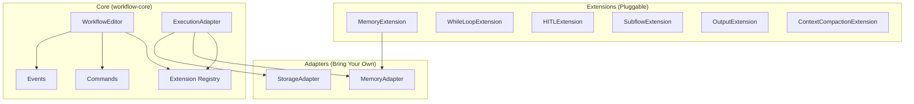

# Core Features v2 - Technical Design

## Overview

This document provides technical design following TipTap's architecture philosophy:

-   **Extensions**: Features as composable, configurable extensions
-   **Adapters**: Bring-your-own implementations for persistence
-   **Commands**: Actions exposed through a command API
-   **Events**: Observable lifecycle hooks

---

## Architecture Overview



---

## 1. Memory System (Pluggable)

### Design Approach

Provide a minimal `MemoryAdapter` interface. Ship with `InMemoryAdapter` as default. Developers implement for their infrastructure.

### Interfaces

````typescript
// packages/workflow-core/src/memory.ts

/**
 * Represents a memory entry for storage/retrieval.
 * Kept minimal - developers can extend metadata as needed.
 */
export interface MemoryEntry {
    id: string;
    content: string;
    metadata: {
        timestamp: string;
        source: 'user' | 'agent' | 'system';
        nodeId?: string;
        workflowId?: string;
        sessionId?: string;
        [key: string]: unknown; // Extensible
    };
}

/**
 * Query parameters for memory retrieval.
 */
export interface MemoryQuery {
    /** Text to search for (semantic or keyword based on adapter) */
    text?: string;
    /** Maximum results to return */
    limit?: number;
    /** Filter by metadata fields */
    filter?: Record<string, unknown>;
    /** Session ID to scope query */
    sessionId?: string;
}

/**
 * Memory adapter interface - implement this to bring your own storage.
 *
 * @example Redis implementation
 * ```typescript
 * class RedisMemoryAdapter implements MemoryAdapter {
 *   constructor(private redis: Redis) {}
 *
 *   async store(entry: MemoryEntry): Promise<void> {
 *     await this.redis.hset(`memory:${entry.id}`, entry);
 *   }
 *
 *   async query(query: MemoryQuery): Promise<MemoryEntry[]> {
 *     // Implement your search logic
 *   }
 * }
 * ```
 */
export interface MemoryAdapter {
    /** Store a memory entry */
    store(entry: MemoryEntry): Promise<void>;

    /** Query for relevant memories */
    query(query: MemoryQuery): Promise<MemoryEntry[]>;

    /** Delete a specific memory */
    delete(id: string): Promise<void>;

    /** Clear all memories (optionally filtered by session) */
    clear(sessionId?: string): Promise<void>;
}

/**
 * Default in-memory adapter for development/testing.
 * NOT suitable for production - use a persistent adapter.
 */
export class InMemoryAdapter implements MemoryAdapter {
    private entries: Map<string, MemoryEntry> = new Map();

    async store(entry: MemoryEntry): Promise<void> {
        this.entries.set(entry.id, entry);
    }

    async query(query: MemoryQuery): Promise<MemoryEntry[]> {
        let results = Array.from(this.entries.values());

        // Filter by session
        if (query.sessionId) {
            results = results.filter(
                (e) => e.metadata.sessionId === query.sessionId
            );
        }

        // Simple text search (production would use embeddings)
        if (query.text) {
            const searchText = query.text.toLowerCase();
            results = results.filter((e) =>
                e.content.toLowerCase().includes(searchText)
            );
        }

        // Apply metadata filters
        if (query.filter) {
            results = results.filter((e) => {
                for (const [key, value] of Object.entries(query.filter!)) {
                    if (e.metadata[key] !== value) return false;
                }
                return true;
            });
        }

        // Sort by timestamp descending and limit
        results.sort(
            (a, b) =>
                new Date(b.metadata.timestamp).getTime() -
                new Date(a.metadata.timestamp).getTime()
        );

        return results.slice(0, query.limit || 10);
    }

    async delete(id: string): Promise<void> {
        this.entries.delete(id);
    }

    async clear(sessionId?: string): Promise<void> {
        if (sessionId) {
            for (const [id, entry] of this.entries) {
                if (entry.metadata.sessionId === sessionId) {
                    this.entries.delete(id);
                }
            }
        } else {
            this.entries.clear();
        }
    }
}
````

### Session Memory (Built-in)

```typescript
// packages/workflow-core/src/session.ts

/**
 * Session manages conversation history for a single execution session.
 * This is always in-memory and tied to the execution lifecycle.
 */
export interface Session {
    /** Unique session identifier */
    id: string;

    /** Conversation messages in this session */
    messages: ChatMessage[];

    /** Add a message to the session */
    addMessage(message: ChatMessage): void;

    /** Get recent messages */
    getRecent(limit?: number): ChatMessage[];

    /** Clear all messages */
    clear(): void;

    /** Get total message count */
    get messageCount(): number;

    /** Get approximate token count */
    get tokenCount(): number;
}

export class ExecutionSession implements Session {
    id: string;
    messages: ChatMessage[] = [];

    constructor(id?: string) {
        this.id = id || crypto.randomUUID();
    }

    addMessage(message: ChatMessage): void {
        this.messages.push(message);
    }

    getRecent(limit = 10): ChatMessage[] {
        return this.messages.slice(-limit);
    }

    clear(): void {
        this.messages = [];
    }

    get messageCount(): number {
        return this.messages.length;
    }

    get tokenCount(): number {
        // Approximate: 4 chars ≈ 1 token
        return Math.ceil(
            this.messages.reduce((sum, m) => sum + m.content.length, 0) / 4
        );
    }
}
```

### Integration with ExecutionContext

```typescript
// Extended ExecutionContext
export interface ExecutionContext {
  // ... existing fields

  /** Current session (in-memory conversation history) */
  session: Session;

  /** Long-term memory adapter (developer-provided or default) */
  memory: MemoryAdapter;
}

// In OpenRouterExecutionAdapter
constructor(client: OpenRouter, options: ExecutionOptions = {}) {
  this.memory = options.memory || new InMemoryAdapter();
  // ...
}

async execute(workflow, input, callbacks) {
  const session = new ExecutionSession(options.sessionId);

  const context: InternalExecutionContext = {
    // ... existing
    session,
    memory: this.memory,
  };

  // Add user message to session
  session.addMessage({ role: 'user', content: input.text });

  // ... execution logic

  // Add final output to session
  session.addMessage({ role: 'assistant', content: finalOutput });
}
```

---

## 2. While Loop

### Design Approach

While loops use LLM-based condition evaluation by default. The loop maintains state accessible to nodes inside it.

### Interfaces

```typescript
// packages/workflow-core/src/extensions/WhileLoopExtension.ts

export interface WhileLoopNodeData extends BaseNodeData {
    /** Prompt to evaluate whether to continue looping */
    conditionPrompt: string;

    /** Model to use for condition evaluation (defaults to workflow default) */
    conditionModel?: string;

    /** Maximum iterations before forced exit */
    maxIterations: number;

    /** What to do when maxIterations reached */
    onMaxIterations: 'error' | 'warning' | 'continue';

    /** Custom evaluator function name (for deterministic evaluation) */
    customEvaluator?: string;
}

export interface LoopState {
    /** Current iteration (0-indexed) */
    iteration: number;

    /** Outputs from all previous iterations */
    outputs: string[];

    /** Output from the most recent iteration */
    lastOutput: string | null;

    /** Total iterations when loop exits */
    totalIterations?: number;

    /** Whether the loop is currently active */
    isActive: boolean;
}

export const WhileLoopExtension: NodeExtension = {
    name: 'whileLoop',
    type: 'node',

    inputs: [
        {
            id: 'input',
            type: 'input',
            label: 'Input',
            dataType: 'any',
            required: true,
        },
    ],

    outputs: [
        { id: 'body', type: 'output', label: 'Loop Body', dataType: 'any' },
        { id: 'done', type: 'output', label: 'Exit', dataType: 'any' },
    ],

    defaultData: {
        label: 'While Loop',
        conditionPrompt:
            'Based on the current output, should we continue iterating to improve the result? Respond with only "continue" or "done".',
        maxIterations: 10,
        onMaxIterations: 'warning',
    },

    // Storage for loop state per execution
    storage: {
        loopStates: new Map<string, LoopState>(),
    },
};
```

### Loop Execution Logic

```typescript
// In OpenRouterExecutionAdapter

private async executeWhileLoopNode(
  node: WorkflowNode,
  context: InternalExecutionContext,
  graph: WorkflowGraph,
  edges: WorkflowEdge[],
  callbacks: ExecutionCallbacks
): Promise<{ output: string; nextNodes: string[] }> {
  const data = node.data as WhileLoopNodeData;

  // Get or create loop state
  let loopState = this.loopStates.get(node.id);
  if (!loopState) {
    loopState = {
      iteration: 0,
      outputs: [],
      lastOutput: null,
      isActive: true,
    };
    this.loopStates.set(node.id, loopState);
  }

  // Find body and exit edges
  const bodyEdge = edges.find(e => e.source === node.id && e.sourceHandle === 'body');
  const exitEdge = edges.find(e => e.source === node.id && e.sourceHandle === 'done');

  // Check max iterations
  if (loopState.iteration >= data.maxIterations) {
    this.loopStates.delete(node.id);

    const message = `While loop reached max iterations (${data.maxIterations})`;
    if (data.onMaxIterations === 'error') {
      throw new Error(message);
    }
    if (data.onMaxIterations === 'warning') {
      callbacks.onNodeError?.(node.id, new Error(message));
    }

    return {
      output: loopState.lastOutput || context.currentInput,
      nextNodes: exitEdge ? [exitEdge.target] : [],
    };
  }

  // Evaluate condition
  const shouldContinue = await this.evaluateLoopCondition(
    data,
    context,
    loopState,
    callbacks
  );

  if (shouldContinue) {
    // Continue looping - execute body
    loopState.iteration++;

    // Execute body subgraph
    const bodyResult = await this.executeSubgraph(
      bodyEdge!.target,
      context,
      graph,
      edges,
      callbacks
    );

    // Update loop state
    loopState.outputs.push(bodyResult.output);
    loopState.lastOutput = bodyResult.output;
    context.currentInput = bodyResult.output;

    // Re-queue this node to check condition again
    return {
      output: bodyResult.output,
      nextNodes: [node.id], // Loop back to self
    };
  } else {
    // Exit loop
    loopState.totalIterations = loopState.iteration;
    this.loopStates.delete(node.id);

    return {
      output: loopState.lastOutput || context.currentInput,
      nextNodes: exitEdge ? [exitEdge.target] : [],
    };
  }
}

private async evaluateLoopCondition(
  data: WhileLoopNodeData,
  context: InternalExecutionContext,
  loopState: LoopState,
  callbacks: ExecutionCallbacks
): Promise<boolean> {
  // First iteration always continues (need to run at least once)
  if (loopState.iteration === 0) {
    return true;
  }

  // Custom evaluator takes precedence
  if (data.customEvaluator && this.options.customEvaluators?.[data.customEvaluator]) {
    return this.options.customEvaluators[data.customEvaluator](context, loopState);
  }

  // LLM-based evaluation
  const model = data.conditionModel || this.options.defaultModel || DEFAULT_MODEL;

  const prompt = `${data.conditionPrompt}

Current iteration: ${loopState.iteration}
Last output: ${loopState.lastOutput}
${loopState.outputs.length > 1 ? `Previous outputs summary: ${loopState.outputs.length} iterations completed` : ''}

Respond with only "continue" or "done".`;

  const response = await this.client.chat.send({
    model,
    messages: [
      { role: 'system', content: 'You are a loop controller. Respond with only "continue" or "done".' },
      { role: 'user', content: prompt },
    ],
  });

  const decision = (response.choices[0]?.message?.content as string || '').toLowerCase().trim();
  return decision === 'continue';
}
```

---

## 3. Hardened Error Handling

### Design Approach

Error handling is layered: per-node retry config, error output branches, and structured error context.

### Interfaces

```typescript
// packages/workflow-core/src/errors.ts

export interface NodeRetryConfig {
    /** Maximum retry attempts */
    maxRetries: number;

    /** Base delay in ms (doubled each retry) */
    baseDelay: number;

    /** Maximum delay in ms */
    maxDelay?: number;

    /** Only retry on these error codes (empty = retry all) */
    retryOn?: string[];

    /** Don't retry on these error codes */
    skipOn?: string[];
}

export interface ExecutionError extends Error {
    /** Node that generated the error */
    nodeId: string;

    /** Error classification */
    code:
        | 'LLM_ERROR'
        | 'TIMEOUT'
        | 'RATE_LIMIT'
        | 'VALIDATION'
        | 'NETWORK'
        | 'UNKNOWN';

    /** HTTP status code if applicable */
    statusCode?: number;

    /** Retry information */
    retry?: {
        attempts: number;
        maxAttempts: number;
        history: Array<{
            attempt: number;
            error: string;
            timestamp: string;
        }>;
    };

    /** Rate limit info if applicable */
    rateLimit?: {
        limit: number;
        remaining: number;
        resetAt: string;
    };

    /** Original error */
    cause?: Error;
}

export type ErrorHandlingMode = 'stop' | 'continue' | 'branch';

export interface NodeErrorConfig {
    /** How to handle errors */
    mode: ErrorHandlingMode;

    /** Retry configuration */
    retry?: NodeRetryConfig;
}
```

### Enhanced Node Data

```typescript
// Extended AgentNodeData
export interface AgentNodeData extends BaseNodeData {
    // ... existing fields

    /** Error handling configuration */
    errorHandling?: NodeErrorConfig;
}
```

### Error Handling in Execution

```typescript
// In OpenRouterExecutionAdapter

private async executeNodeWithErrorHandling(
  node: WorkflowNode,
  context: InternalExecutionContext,
  graph: WorkflowGraph,
  edges: WorkflowEdge[],
  callbacks: ExecutionCallbacks
): Promise<{ output: string; nextNodes: string[] }> {
  const errorConfig = (node.data as any).errorHandling as NodeErrorConfig | undefined;
  const retryConfig = errorConfig?.retry;

  // Find error branch
  const errorEdge = edges.find(e =>
    e.source === node.id && e.sourceHandle === 'error'
  );

  let lastError: ExecutionError | null = null;
  const retryHistory: Array<{ attempt: number; error: string; timestamp: string }> = [];

  const maxAttempts = (retryConfig?.maxRetries ?? 0) + 1;

  for (let attempt = 1; attempt <= maxAttempts; attempt++) {
    try {
      return await this.executeNode(node, context, graph, edges, callbacks);
    } catch (error) {
      const execError = this.wrapError(error, node.id, attempt, maxAttempts, retryHistory);
      lastError = execError;

      retryHistory.push({
        attempt,
        error: execError.message,
        timestamp: new Date().toISOString(),
      });

      // Check if we should retry
      const shouldRetry = attempt < maxAttempts && this.shouldRetry(execError, retryConfig);

      if (shouldRetry) {
        const delay = Math.min(
          retryConfig!.baseDelay * Math.pow(2, attempt - 1),
          retryConfig!.maxDelay || 30000
        );
        await this.sleep(delay);
        continue;
      }

      // No more retries - handle based on mode
      const mode = errorConfig?.mode || 'stop';

      if (mode === 'branch' && errorEdge) {
        // Route to error branch with error context
        context.outputs[`${node.id}_error`] = JSON.stringify(execError);
        return {
          output: '',
          nextNodes: [errorEdge.target],
        };
      }

      if (mode === 'continue') {
        // Log error and continue with empty output
        callbacks.onNodeError(node.id, execError);
        return {
          output: '',
          nextNodes: this.getChildNodes(node.id, edges),
        };
      }

      // mode === 'stop' - throw to stop execution
      throw execError;
    }
  }

  throw lastError!;
}

private wrapError(
  error: unknown,
  nodeId: string,
  attempt: number,
  maxAttempts: number,
  history: Array<{ attempt: number; error: string; timestamp: string }>
): ExecutionError {
  const base = error instanceof Error ? error : new Error(String(error));

  const execError = base as ExecutionError;
  execError.nodeId = nodeId;
  execError.code = this.classifyError(error);
  execError.retry = { attempts: attempt, maxAttempts, history };
  execError.cause = base;

  return execError;
}

private classifyError(error: unknown): ExecutionError['code'] {
  if (error instanceof Error) {
    const msg = error.message.toLowerCase();
    if (msg.includes('rate limit')) return 'RATE_LIMIT';
    if (msg.includes('timeout')) return 'TIMEOUT';
    if (msg.includes('network') || msg.includes('fetch')) return 'NETWORK';
    if (msg.includes('validation')) return 'VALIDATION';
  }
  return 'UNKNOWN';
}

private shouldRetry(error: ExecutionError, config?: NodeRetryConfig): boolean {
  if (!config) return false;

  // Check skipOn
  if (config.skipOn?.includes(error.code)) return false;

  // Check retryOn (if specified, only retry those)
  if (config.retryOn?.length && !config.retryOn.includes(error.code)) return false;

  // Don't retry validation errors
  if (error.code === 'VALIDATION') return false;

  return true;
}
```

---

## 4. Human-in-the-Loop (HITL)

### Design Approach

HITL is opt-in per node. The framework provides the pause/resume mechanism; developers provide the UI via callbacks.

### Interfaces

````typescript
// packages/workflow-core/src/hitl.ts

export type HITLMode = 'approval' | 'input' | 'review';

export interface HITLConfig {
    /** Enable HITL for this node */
    enabled: boolean;

    /** HITL mode */
    mode: HITLMode;

    /** Prompt to show the human */
    prompt?: string;

    /** Schema for input mode (JSON Schema) */
    inputSchema?: Record<string, unknown>;

    /** Options for approval mode */
    options?: Array<{
        id: string;
        label: string;
        action: 'approve' | 'reject' | 'custom';
    }>;

    /** Timeout in ms (0 = no timeout) */
    timeout?: number;

    /** Default action on timeout */
    defaultAction?: 'approve' | 'reject' | 'skip';
}

export interface HITLRequest {
    /** Unique request ID */
    id: string;

    /** Node requiring HITL */
    nodeId: string;

    /** HITL mode */
    mode: HITLMode;

    /** Prompt to display */
    prompt: string;

    /** Current context */
    context: {
        input: string;
        output?: string; // Only for review mode
        nodeLabel: string;
        workflowName: string;
    };

    /** Options for approval */
    options?: Array<{ id: string; label: string; action: string }>;

    /** Schema for input */
    inputSchema?: Record<string, unknown>;

    /** Request timestamp */
    createdAt: string;

    /** Expiry timestamp if timeout set */
    expiresAt?: string;
}

export interface HITLResponse {
    /** Request ID being responded to */
    requestId: string;

    /** Action taken */
    action: 'approve' | 'reject' | 'submit' | 'modify' | 'skip';

    /** Input/modification data */
    data?: string | Record<string, unknown>;

    /** Who responded */
    respondedBy?: string;

    /** Response timestamp */
    respondedAt: string;
}

/**
 * HITL callback - implement this to show UI for human interaction.
 *
 * @example
 * ```typescript
 * const adapter = new OpenRouterExecutionAdapter(client, {
 *   onHITLRequest: async (request) => {
 *     // Show your UI (modal, Slack message, email, etc.)
 *     const userResponse = await showApprovalModal(request);
 *     return {
 *       requestId: request.id,
 *       action: userResponse.approved ? 'approve' : 'reject',
 *       respondedAt: new Date().toISOString(),
 *     };
 *   },
 * });
 * ```
 */
export type HITLCallback = (request: HITLRequest) => Promise<HITLResponse>;
````

### HITL Execution Logic

```typescript
// In OpenRouterExecutionAdapter

private async executeWithHITL(
  node: WorkflowNode,
  context: InternalExecutionContext,
  graph: WorkflowGraph,
  edges: WorkflowEdge[],
  callbacks: ExecutionCallbacks
): Promise<{ output: string; nextNodes: string[] }> {
  const hitlConfig = (node.data as any).hitl as HITLConfig | undefined;

  // No HITL configured or disabled
  if (!hitlConfig?.enabled || !this.options.onHITLRequest) {
    return this.executeNode(node, context, graph, edges, callbacks);
  }

  const workflow = context.workflow;

  switch (hitlConfig.mode) {
    case 'approval': {
      // Pause BEFORE execution for approval
      const request = this.createHITLRequest(node, hitlConfig, context, undefined);
      const response = await this.waitForHITL(request, hitlConfig);

      if (response.action === 'reject') {
        // Find rejection branch or stop
        const rejectEdge = edges.find(e =>
          e.source === node.id && e.sourceHandle === 'rejected'
        );
        if (rejectEdge) {
          return { output: '', nextNodes: [rejectEdge.target] };
        }
        throw new Error('HITL: Request rejected');
      }

      // Approved - execute with possibly modified input
      if (response.data) {
        context.currentInput = String(response.data);
      }
      return this.executeNode(node, context, graph, edges, callbacks);
    }

    case 'input': {
      // Pause to collect human input
      const request = this.createHITLRequest(node, hitlConfig, context, undefined);
      const response = await this.waitForHITL(request, hitlConfig);

      if (response.action === 'skip') {
        return { output: context.currentInput, nextNodes: this.getChildNodes(node.id, edges) };
      }

      // Use human input as node input
      context.currentInput = typeof response.data === 'string'
        ? response.data
        : JSON.stringify(response.data);

      return this.executeNode(node, context, graph, edges, callbacks);
    }

    case 'review': {
      // Execute first, then pause for review
      const result = await this.executeNode(node, context, graph, edges, callbacks);

      const request = this.createHITLRequest(node, hitlConfig, context, result.output);
      const response = await this.waitForHITL(request, hitlConfig);

      if (response.action === 'reject') {
        // Re-execute or route to error
        const rejectEdge = edges.find(e =>
          e.source === node.id && e.sourceHandle === 'rejected'
        );
        if (rejectEdge) {
          return { output: result.output, nextNodes: [rejectEdge.target] };
        }
        // Re-execute
        return this.executeNode(node, context, graph, edges, callbacks);
      }

      if (response.action === 'modify' && response.data) {
        // Use modified output
        return { output: String(response.data), nextNodes: result.nextNodes };
      }

      return result;
    }
  }

  return this.executeNode(node, context, graph, edges, callbacks);
}

private async waitForHITL(request: HITLRequest, config: HITLConfig): Promise<HITLResponse> {
  if (!this.options.onHITLRequest) {
    throw new Error('HITL requested but no onHITLRequest callback configured');
  }

  if (config.timeout && config.timeout > 0) {
    const timeoutPromise = new Promise<HITLResponse>((resolve) => {
      setTimeout(() => {
        resolve({
          requestId: request.id,
          action: config.defaultAction === 'approve' ? 'approve' :
                  config.defaultAction === 'skip' ? 'skip' : 'reject',
          respondedAt: new Date().toISOString(),
        });
      }, config.timeout);
    });

    return Promise.race([
      this.options.onHITLRequest(request),
      timeoutPromise,
    ]);
  }

  return this.options.onHITLRequest(request);
}
```

---

## 5. Subflows

### Design Approach

Subflows are workflows marked as reusable with defined input/output contracts. They execute with isolated context but can share session memory.

### Interfaces

```typescript
// packages/workflow-core/src/subflow.ts

export interface SubflowDefinition {
    /** Unique identifier for the subflow */
    id: string;

    /** Display name */
    name: string;

    /** Input ports */
    inputs: Array<{
        id: string;
        name: string;
        type: 'string' | 'number' | 'object' | 'array' | 'any';
        required?: boolean;
        default?: unknown;
    }>;

    /** Output ports */
    outputs: Array<{
        id: string;
        name: string;
        type: 'string' | 'number' | 'object' | 'array' | 'any';
    }>;

    /** The workflow data */
    workflow: WorkflowData;
}

export interface SubflowNodeData extends BaseNodeData {
    /** Reference to subflow definition */
    subflowId: string;

    /** Input mappings: subflow input ID -> expression or value */
    inputMappings: Record<string, string | unknown>;

    /** Whether to share parent session with subflow */
    shareSession?: boolean;
}

export interface SubflowRegistry {
    /** Register a subflow definition */
    register(subflow: SubflowDefinition): void;

    /** Get a subflow by ID */
    get(id: string): SubflowDefinition | undefined;

    /** List all registered subflows */
    list(): SubflowDefinition[];

    /** Unregister a subflow */
    unregister(id: string): void;
}

export class DefaultSubflowRegistry implements SubflowRegistry {
    private subflows = new Map<string, SubflowDefinition>();

    register(subflow: SubflowDefinition): void {
        this.subflows.set(subflow.id, subflow);
    }

    get(id: string): SubflowDefinition | undefined {
        return this.subflows.get(id);
    }

    list(): SubflowDefinition[] {
        return Array.from(this.subflows.values());
    }

    unregister(id: string): void {
        this.subflows.delete(id);
    }
}
```

### Subflow Node Extension

```typescript
// packages/workflow-core/src/extensions/SubflowNodeExtension.ts

export const SubflowNodeExtension: NodeExtension = {
    name: 'subflow',
    type: 'node',

    inputs: [
        {
            id: 'input',
            type: 'input',
            label: 'Input',
            dataType: 'any',
            required: true,
        },
    ],

    outputs: [
        { id: 'output', type: 'output', label: 'Output', dataType: 'any' },
        { id: 'error', type: 'output', label: 'Error', dataType: 'any' },
    ],

    defaultData: {
        label: 'Subflow',
        subflowId: '',
        inputMappings: {},
        shareSession: true,
    },

    validate(
        node: WorkflowNode,
        edges: WorkflowEdge[]
    ): (ValidationError | ValidationWarning)[] {
        const errors: (ValidationError | ValidationWarning)[] = [];
        const data = node.data as SubflowNodeData;

        if (!data.subflowId) {
            errors.push({
                type: 'error',
                code: 'MISSING_SUBFLOW',
                message: 'Subflow node requires a subflow to be selected',
                nodeId: node.id,
            });
        }

        return errors;
    },
};
```

### Subflow Execution

```typescript
// In OpenRouterExecutionAdapter

private async executeSubflowNode(
  node: WorkflowNode,
  context: InternalExecutionContext,
  callbacks: ExecutionCallbacks
): Promise<{ output: string; nextNodes: string[] }> {
  const data = node.data as SubflowNodeData;

  const subflow = this.subflowRegistry.get(data.subflowId);
  if (!subflow) {
    throw new Error(`Subflow not found: ${data.subflowId}`);
  }

  // Build subflow inputs
  const subflowInputs: Record<string, unknown> = {};
  for (const [inputId, mapping] of Object.entries(data.inputMappings)) {
    if (typeof mapping === 'string' && mapping.startsWith('{{')) {
      // Expression - evaluate
      subflowInputs[inputId] = this.evaluateExpression(mapping, context);
    } else {
      subflowInputs[inputId] = mapping;
    }
  }

  // Create isolated context for subflow
  const subflowContext: InternalExecutionContext = {
    ...context,
    input: JSON.stringify(subflowInputs),
    currentInput: JSON.stringify(subflowInputs),
    outputs: {},
    nodeChain: [],
    // Share session if configured
    session: data.shareSession ? context.session : new ExecutionSession(),
    // Always share memory adapter
    memory: context.memory,
  };

  // Execute subflow
  const result = await this.executeWorkflow(subflow.workflow, subflowContext, callbacks);

  if (!result.success) {
    // Route to error output
    const errorEdge = context.edges.find(e =>
      e.source === node.id && e.sourceHandle === 'error'
    );
    if (errorEdge) {
      return { output: result.error?.message || 'Subflow failed', nextNodes: [errorEdge.target] };
    }
    throw result.error || new Error('Subflow execution failed');
  }

  return {
    output: result.output,
    nextNodes: this.getChildNodes(node.id, context.edges),
  };
}
```

---

## 6. Output Node

### Design Approach

Output nodes are terminal nodes that format the final workflow response.

### Interfaces

```typescript
// packages/workflow-core/src/extensions/OutputNodeExtension.ts

export interface OutputNodeData extends BaseNodeData {
    /** Output format */
    format: 'text' | 'json' | 'markdown';

    /** Template with {{nodeId}} placeholders */
    template?: string;

    /** Include execution metadata in output */
    includeMetadata?: boolean;

    /** JSON schema to validate output against */
    schema?: Record<string, unknown>;
}

export const OutputNodeExtension: NodeExtension = {
    name: 'output',
    type: 'node',

    inputs: [
        {
            id: 'input',
            type: 'input',
            label: 'Input',
            dataType: 'any',
            required: true,
        },
    ],

    outputs: [], // Terminal node - no outputs

    defaultData: {
        label: 'Output',
        format: 'text',
    },

    async execute(
        context: ExecutionContext
    ): Promise<{ output: string; nextNodes: string[] }> {
        const data = context.node.data as OutputNodeData;

        let output: string;

        if (data.template) {
            // Interpolate template
            output = data.template.replace(/\{\{(\w+)\}\}/g, (_, nodeId) => {
                return context.outputs[nodeId] || `{{${nodeId}}}`;
            });
        } else {
            output = context.input;
        }

        // Format
        if (data.format === 'json') {
            try {
                const parsed = JSON.parse(output);
                output = JSON.stringify(
                    data.includeMetadata
                        ? {
                              result: parsed,
                              metadata: {
                                  nodeChain: context.nodeChain,
                                  timestamp: new Date().toISOString(),
                              },
                          }
                        : parsed,
                    null,
                    2
                );
            } catch {
                // Not valid JSON, wrap it
                output = JSON.stringify({ result: output }, null, 2);
            }
        }

        return { output, nextNodes: [] }; // Terminal
    },
};
```

---

## 7. Context Compaction

### Design Approach

Automatic context management that compacts older messages when approaching model limits. Recent messages are always preserved.

### Interfaces

```typescript
// packages/workflow-core/src/compaction.ts

export type CompactionStrategy = 'summarize' | 'truncate' | 'custom';

export interface CompactionConfig {
    /**
     * Token threshold to trigger compaction.
     * 'auto' = modelLimit - 10000
     * number = specific token count
     */
    threshold: 'auto' | number;

    /** Number of recent messages to never compact */
    preserveRecent: number;

    /** Compaction strategy */
    strategy: CompactionStrategy;

    /** Model to use for summarization (defaults to current model) */
    summarizeModel?: string;

    /** Custom summarization prompt */
    summarizePrompt?: string;

    /** Custom compaction function */
    customCompactor?: (
        messages: ChatMessage[],
        targetTokens: number
    ) => Promise<ChatMessage[]>;
}

export const DEFAULT_COMPACTION_CONFIG: CompactionConfig = {
    threshold: 'auto',
    preserveRecent: 5,
    strategy: 'summarize',
    summarizePrompt: `Summarize the following conversation history concisely, preserving key information, decisions, and context that would be important for continuing the conversation:

{{messages}}

Provide a concise summary that captures the essential context.`,
};

export interface TokenCounter {
    /** Count tokens in text */
    count(text: string, model?: string): number;

    /** Get model's context limit */
    getLimit(model: string): number;
}

// Simple approximation - 4 chars ≈ 1 token
export class ApproximateTokenCounter implements TokenCounter {
    private modelLimits: Record<string, number> = {
        'openai/gpt-4o': 128000,
        'openai/gpt-4o-mini': 128000,
        'openai/gpt-4-turbo': 128000,
        'anthropic/claude-3-opus': 200000,
        'anthropic/claude-3.5-sonnet': 200000,
        'anthropic/claude-3-haiku': 200000,
        'google/gemini-1.5-pro': 1000000,
        'google/gemini-1.5-flash': 1000000,
        // Default for unknown models
        default: 8192,
    };

    count(text: string): number {
        return Math.ceil(text.length / 4);
    }

    getLimit(model: string): number {
        return this.modelLimits[model] || this.modelLimits['default']!;
    }
}
```

### Compaction Logic

```typescript
// In OpenRouterExecutionAdapter

private async compactContextIfNeeded(
  messages: ChatMessage[],
  model: string
): Promise<ChatMessage[]> {
  const config = this.options.compaction || DEFAULT_COMPACTION_CONFIG;
  const tokenCounter = this.options.tokenCounter || new ApproximateTokenCounter();

  // Calculate current token count
  const currentTokens = messages.reduce((sum, m) =>
    sum + tokenCounter.count(m.content), 0
  );

  // Calculate threshold
  const modelLimit = tokenCounter.getLimit(model);
  const threshold = config.threshold === 'auto'
    ? modelLimit - 10000
    : config.threshold;

  // Check if compaction needed
  if (currentTokens < threshold) {
    return messages;
  }

  // Split into preserve and compact sections
  const preserveCount = config.preserveRecent;
  const toPreserve = messages.slice(-preserveCount);
  const toCompact = messages.slice(0, -preserveCount);

  if (toCompact.length === 0) {
    // Nothing to compact - already at minimum
    return messages;
  }

  let compactedMessages: ChatMessage[];

  switch (config.strategy) {
    case 'summarize':
      const summary = await this.summarizeMessages(toCompact, config, model);
      compactedMessages = [
        { role: 'system', content: `[Previous conversation summary]: ${summary}` },
        ...toPreserve,
      ];
      break;

    case 'truncate':
      // Just drop old messages
      compactedMessages = toPreserve;
      break;

    case 'custom':
      if (!config.customCompactor) {
        throw new Error('Custom compaction strategy requires customCompactor function');
      }
      compactedMessages = await config.customCompactor(messages, threshold);
      break;

    default:
      compactedMessages = messages;
  }

  return compactedMessages;
}

private async summarizeMessages(
  messages: ChatMessage[],
  config: CompactionConfig,
  currentModel: string
): Promise<string> {
  const model = config.summarizeModel || currentModel;
  const prompt = (config.summarizePrompt || DEFAULT_COMPACTION_CONFIG.summarizePrompt!)
    .replace('{{messages}}', messages.map(m => `${m.role}: ${m.content}`).join('\n\n'));

  const response = await this.client.chat.send({
    model,
    messages: [
      { role: 'system', content: 'You are a conversation summarizer. Be concise but preserve key information.' },
      { role: 'user', content: prompt },
    ],
  });

  return (response.choices[0]?.message?.content as string) || '';
}
```

---

## TipTap-style Extension Architecture

### Extension Configuration Pattern

```typescript
// packages/workflow-core/src/extensions/index.ts

export interface ExtensionConfig<T = any> {
    /** Extension name */
    name: string;

    /** Default options */
    defaultOptions?: Partial<T>;

    /** Configure the extension */
    configure?: (options: Partial<T>) => Extension;
}

// Example: HITLExtension with configuration
export const HITLExtension = {
    name: 'hitl',

    defaultOptions: {
        defaultMode: 'approval' as HITLMode,
        defaultTimeout: 0,
    },

    configure(
        options: Partial<{ defaultMode: HITLMode; defaultTimeout: number }>
    ) {
        return {
            name: 'hitl',
            type: 'behavior',
            storage: {
                pendingRequests: new Map(),
            },
            options: { ...this.defaultOptions, ...options },
            onCreate() {
                // Initialize HITL system
            },
        };
    },
};

// Usage
const editor = new WorkflowEditor({
    extensions: [
        StarterKit, // Includes core nodes
        HITLExtension.configure({
            defaultMode: 'approval',
            defaultTimeout: 30000,
        }),
        WhileLoopExtension,
        SubflowExtension.configure({
            registry: mySubflowRegistry,
            maxNestingDepth: 5,
        }),
    ],
});
```

### StarterKit Pattern

```typescript
// packages/workflow-core/src/extensions/StarterKit.ts

export interface StarterKitOptions {
    /** Include While Loop node */
    whileLoop?: boolean | Partial<WhileLoopConfig>;

    /** Include Subflow node */
    subflow?: boolean | Partial<SubflowConfig>;

    /** Include Output node */
    output?: boolean;

    /** Enable HITL support */
    hitl?: boolean | Partial<HITLConfig>;
}

export const StarterKit = {
    name: 'starterKit',

    configure(options: StarterKitOptions = {}) {
        const extensions: Extension[] = [
            // Always include core nodes
            StartNodeExtension,
            AgentNodeExtension,
            RouterNodeExtension,
            ParallelNodeExtension,
            ToolNodeExtension,
        ];

        // Optional extensions
        if (options.whileLoop !== false) {
            extensions.push(
                typeof options.whileLoop === 'object'
                    ? WhileLoopExtension.configure(options.whileLoop)
                    : WhileLoopExtension
            );
        }

        if (options.subflow !== false) {
            extensions.push(
                typeof options.subflow === 'object'
                    ? SubflowExtension.configure(options.subflow)
                    : SubflowExtension
            );
        }

        if (options.output !== false) {
            extensions.push(OutputNodeExtension);
        }

        if (options.hitl) {
            extensions.push(
                typeof options.hitl === 'object'
                    ? HITLExtension.configure(options.hitl)
                    : HITLExtension
            );
        }

        return extensions;
    },
};
```

---

## Summary of New Files

```
packages/workflow-core/src/
├── memory.ts                 # MemoryAdapter interface + InMemoryAdapter
├── session.ts                # Session management
├── compaction.ts             # Context compaction logic
├── hitl.ts                   # HITL types and interfaces
├── subflow.ts                # Subflow registry and types
├── errors.ts                 # Enhanced error types
├── extensions/
│   ├── WhileLoopExtension.ts
│   ├── SubflowExtension.ts
│   ├── OutputNodeExtension.ts
│   ├── StarterKit.ts
│   └── index.ts              # Updated exports

packages/workflow-vue/src/components/nodes/
├── WhileLoopNode.vue
├── SubflowNode.vue
├── OutputNode.vue
```

---

## API Examples

### Basic Usage

```typescript
import {
    WorkflowEditor,
    StarterKit,
    OpenRouterExecutionAdapter,
} from '@or3/workflow-core';
import OpenRouter from '@openrouter/sdk';

// Create editor
const editor = new WorkflowEditor({
    extensions: [StarterKit.configure({ hitl: true })],
});

// Create adapter with pluggable memory
const adapter = new OpenRouterExecutionAdapter(
    new OpenRouter({ apiKey: process.env.OPENROUTER_API_KEY }),
    {
        // Bring your own memory
        memory: new MyRedisMemoryAdapter(redis),

        // Configure compaction
        compaction: {
            threshold: 'auto',
            preserveRecent: 5,
            strategy: 'summarize',
        },

        // HITL callback
        onHITLRequest: async (request) => {
            return await myUIShowApproval(request);
        },
    }
);
```

### Node with HITL and Retry

```typescript
{
  id: 'critical-agent',
  type: 'agent',
  data: {
    label: 'Critical Decision',
    model: 'anthropic/claude-3-opus',
    prompt: 'Make an important decision...',

    // HITL - off by default, opt-in per node
    hitl: {
      enabled: true,
      mode: 'review',
      prompt: 'Please review this decision before it is finalized.',
    },

    // Error handling
    errorHandling: {
      mode: 'branch',
      retry: {
        maxRetries: 3,
        baseDelay: 2000,
        retryOn: ['RATE_LIMIT', 'TIMEOUT'],
      },
    },
  },
}
```
