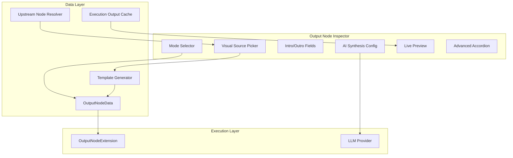

# Output Node UX Redesign - Technical Design

## Overview

This document describes the technical architecture for redesigning the Output Node inspector in `or3-workflows`. The redesign introduces a beginner-friendly visual source picker, mode-based output handling (Combine vs. AI Synthesis), and a live preview system—all while maintaining backwards compatibility with existing template-based workflows.

## Architecture

### System Flow



### Core Components

#### 1. Extended OutputNodeData

```typescript
/**
 * Enhanced output node data with visual picker support.
 */
interface OutputNodeData extends BaseNodeData {
    /** Output mode: 'combine' (no LLM) or 'synthesis' (LLM call) */
    mode: 'combine' | 'synthesis';

    /** 
     * Selected source node IDs in display order.
     * If empty/undefined, uses all upstream nodes in execution order.
     */
    sources?: string[];

    /** Optional introduction text (prepended to output) */
    introText?: string;

    /** Optional conclusion text (appended to output) */
    outroText?: string;

    /** AI Synthesis configuration (only used when mode === 'synthesis') */
    synthesis?: {
        /** Instructions for the AI when synthesizing */
        prompt?: string;
        /** Model override for synthesis */
        model?: string;
    };

    // === Legacy fields (preserved for backwards compat) ===
    
    /** Legacy template with {{nodeId}} placeholders */
    template?: string;

    /** Output format */
    format: OutputFormat;

    /** Include execution metadata */
    includeMetadata?: boolean;

    /** 
     * Flag indicating user is using raw template mode.
     * When true, visual picker is disabled and template is used directly.
     */
    useRawTemplate?: boolean;
}

type OutputFormat = 'text' | 'json' | 'markdown';
```

#### 2. Upstream Node Resolver

```typescript
/**
 * Resolves all upstream nodes that can provide output to the output node.
 * Handles parallel branch grouping and execution order.
 */
interface UpstreamSource {
    /** Node ID */
    id: string;
    /** Display label */
    label: string;
    /** Node type */
    type: string;
    /** For parallel branches: parent parallel node ID */
    parallelParentId?: string;
    /** For parallel branches: branch label */
    branchLabel?: string;
    /** Execution order index (for default ordering) */
    executionIndex: number;
    /** Last execution output (if available) */
    lastOutput?: string;
}

interface UpstreamGroup {
    /** Group type: 'single' for regular nodes, 'parallel' for branch groups */
    type: 'single' | 'parallel';
    /** For parallel groups: the parallel node label */
    label?: string;
    /** Sources in this group */
    sources: UpstreamSource[];
}

/**
 * Composable to resolve upstream sources for an output node.
 */
function useUpstreamResolver(
    editor: WorkflowEditor,
    outputNodeId: string
): ComputedRef<UpstreamGroup[]>;
```

#### 3. Template Generator

```typescript
/**
 * Generates internal template from visual picker configuration.
 * Users never see this template—it's purely internal.
 */
function generateTemplateFromSources(
    sources: string[],
    options: {
        introText?: string;
        outroText?: string;
        separator?: string; // Default: '\n\n'
    }
): string;

// Example output:
// "Introduction text here\n\n{{agent-1}}\n\n{{agent-2}}\n\nConclusion text here"
```

#### 4. Live Preview Component

```typescript
interface PreviewData {
    /** Resolved content for each source */
    sourceContents: Map<string, string | null>;
    /** Final assembled preview */
    assembledPreview: string;
    /** Whether all sources have actual data */
    isComplete: boolean;
    /** Mode-specific message */
    modeHint?: string;
}

/**
 * Composable to generate live preview data.
 * Uses execution cache for real outputs, placeholders for unexecuted nodes.
 */
function useOutputPreview(
    editor: WorkflowEditor,
    nodeData: OutputNodeData,
    executionCache: Map<string, string>
): ComputedRef<PreviewData>;
```

---

## Component Structure

### NodeInspector Output Tab (Redesigned)

```
┌─────────────────────────────────────────────────┐
│ Output                                          │
├─────────────────────────────────────────────────┤
│                                                 │
│  ┌─────────────────┬─────────────────────────┐  │
│  │ ⚡ Combine      │ 🤖 AI Synthesis         │  │
│  │    (selected)   │                         │  │
│  └─────────────────┴─────────────────────────┘  │
│                                                 │
│  📥 Sources                          [+ Add]    │
│  ┌─────────────────────────────────────────────┐│
│  │ ≡ 1. Agent: Research              ✕        ││
│  │ ≡ 2. Agent: Section A             ✕        ││
│  │ ≡ 3. Agent: Section B             ✕        ││
│  │ ≡ 4. Agent: Section C             ✕        ││
│  └─────────────────────────────────────────────┘│
│                                                 │
│  📝 Introduction (optional)                     │
│  ┌─────────────────────────────────────────────┐│
│  │ # My Article                                ││
│  │                                             ││
│  └─────────────────────────────────────────────┘│
│                                                 │
│  📝 Conclusion (optional)                       │
│  ┌─────────────────────────────────────────────┐│
│  │ ---                                         ││
│  │ Written by AI Assistant                     ││
│  └─────────────────────────────────────────────┘│
│                                                 │
│  👁️ Preview                                     │
│  ┌─────────────────────────────────────────────┐│
│  │ # My Article                                ││
│  │                                             ││
│  │ [Research output here]                      ││
│  │                                             ││
│  │ [Section A output here]                     ││
│  │ ...                                         ││
│  │ ---                                         ││
│  │ Written by AI Assistant                     ││
│  └─────────────────────────────────────────────┘│
│                                                 │
│  ▶ Advanced                                     │
├─────────────────────────────────────────────────┤
│  ℹ️ Output Node                                 │
│  Terminal node that formats the final output.  │
└─────────────────────────────────────────────────┘
```

### AI Synthesis Mode Layout

```
┌─────────────────────────────────────────────────┐
│  ┌─────────────────┬─────────────────────────┐  │
│  │ ⚡ Combine      │ 🤖 AI Synthesis         │  │
│  │                 │    (selected)           │  │
│  └─────────────────┴─────────────────────────┘  │
│                                                 │
│  📥 Sources (inputs to AI)           [+ Add]    │
│  ┌─────────────────────────────────────────────┐│
│  │ ≡ 1. Agent: Section A             ✕        ││
│  │ ≡ 2. Agent: Section B             ✕        ││
│  └─────────────────────────────────────────────┘│
│                                                 │
│  🎯 Synthesis Instructions                      │
│  ┌─────────────────────────────────────────────┐│
│  │ Combine these sections into a cohesive     ││
│  │ article. Ensure smooth transitions and     ││
│  │ maintain consistent tone throughout.       ││
│  └─────────────────────────────────────────────┘│
│                                                 │
│  🤖 Model                                       │
│  ┌─────────────────────────────────────────────┐│
│  │ openai/gpt-4o-mini                    ▼   ││
│  └─────────────────────────────────────────────┘│
│                                                 │
│  👁️ Preview                                     │
│  ┌─────────────────────────────────────────────┐│
│  │ Inputs that will be sent to AI:            ││
│  │                                             ││
│  │ • Section A: [output preview...]           ││
│  │ • Section B: [output preview...]           ││
│  │                                             ││
│  │ 🤖 AI will synthesize these into one output││
│  └─────────────────────────────────────────────┘│
└─────────────────────────────────────────────────┘
```

---

## Execution Flow Changes

### Combine Mode (No LLM)

```typescript
async function executeCombineMode(
    context: ExecutionContext,
    data: OutputNodeData
): Promise<{ output: string; nextNodes: string[] }> {
    // 1. Resolve source outputs
    const sourceIds = data.sources?.length 
        ? data.sources 
        : Object.keys(context.outputs);
    
    // 2. Build output parts
    const parts: string[] = [];
    
    if (data.introText?.trim()) {
        parts.push(data.introText.trim());
    }
    
    for (const sourceId of sourceIds) {
        const output = context.outputs[sourceId];
        if (output) {
            parts.push(output);
        }
    }
    
    if (data.outroText?.trim()) {
        parts.push(data.outroText.trim());
    }
    
    // 3. Join with separator
    const content = parts.join('\n\n');
    
    // 4. Apply formatting
    return {
        output: formatOutput(content, data.format, {
            includeMetadata: data.includeMetadata,
            nodeChain: context.nodeChain,
        }),
        nextNodes: [],
    };
}
```

### Synthesis Mode (LLM Call)

```typescript
async function executeSynthesisMode(
    context: ExecutionContext,
    data: OutputNodeData,
    provider: LLMProvider
): Promise<{ output: string; nextNodes: string[] }> {
    // 1. Resolve source outputs
    const sourceIds = data.sources?.length 
        ? data.sources 
        : Object.keys(context.outputs);
    
    // 2. Build synthesis prompt
    const sourceContents = sourceIds
        .map(id => context.outputs[id])
        .filter(Boolean)
        .join('\n\n---\n\n');
    
    const systemPrompt = data.synthesis?.prompt 
        || 'Combine the following sections into a cohesive, well-structured document.';
    
    // 3. Make LLM call
    const model = data.synthesis?.model || context.defaultModel;
    
    const response = await provider.chat({
        model,
        messages: [
            { role: 'system', content: systemPrompt },
            { role: 'user', content: sourceContents },
        ],
        stream: true, // Supports streaming
    });
    
    // 4. Return synthesized output
    return {
        output: formatOutput(response.content, data.format, {
            includeMetadata: data.includeMetadata,
            nodeChain: context.nodeChain,
        }),
        nextNodes: [],
    };
}
```

---

## Vue Components

### OutputSourcePicker.vue

```typescript
interface Props {
    modelValue: string[]; // Selected source IDs
    availableSources: UpstreamGroup[];
    disabled?: boolean;
}

interface Emits {
    (e: 'update:modelValue', value: string[]): void;
}

// Features:
// - Grouped display for parallel branches
// - Drag-and-drop reordering (using @vueuse/core useDraggable)
// - Click to add/remove sources
// - Keyboard navigation (up/down to select, enter to toggle)
```

### OutputPreview.vue

```typescript
interface Props {
    nodeData: OutputNodeData;
    previewData: PreviewData;
    maxHeight?: number; // Default: 200px, scrollable
}

// Features:
// - Markdown rendering for preview
// - Placeholder styling for missing outputs
// - Mode-specific hints
// - Collapsible if content is long
```

### OutputModeSelector.vue

```typescript
interface Props {
    modelValue: 'combine' | 'synthesis';
}

interface Emits {
    (e: 'update:modelValue', value: 'combine' | 'synthesis'): void;
}

// Features:
// - Two-button toggle group
// - Visual icons for each mode
// - Tooltip explanations on hover
```

---

## Data Migration

### Backwards Compatibility Strategy

1. **Detection**: On load, check if `template` field has content and `sources` is empty
2. **Legacy Mode**: If legacy template detected, set `useRawTemplate: true`
3. **Visual Indicator**: Show "Using custom template" badge in UI
4. **Opt-in Migration**: Provide "Switch to visual mode" button that clears template

```typescript
function migrateOutputNodeData(data: any): OutputNodeData {
    // Handle legacy format
    if (data.template && !data.mode) {
        return {
            ...data,
            mode: 'combine',
            useRawTemplate: true,
            format: data.format || 'markdown',
        };
    }
    
    // Handle new format with defaults
    return {
        mode: 'combine',
        format: 'markdown',
        ...data,
    };
}
```

---

## Error Handling

### User-Facing Errors

| Condition | UI Behavior |
|-----------|-------------|
| No upstream connections | Blocking overlay: "Connect an upstream node" |
| Selected source not connected | Auto-remove source, show toast notification |
| AI Synthesis fails | Show error in preview area, allow retry |
| Empty sources in Combine mode | Warning: "No sources selected, output will be empty" |

### Validation

```typescript
function validateOutputNode(
    node: WorkflowNode,
    edges: WorkflowEdge[]
): ValidationResult[] {
    const errors: ValidationResult[] = [];
    const data = node.data as OutputNodeData;
    
    // Check for incoming edges
    const hasIncoming = edges.some(e => e.target === node.id);
    if (!hasIncoming) {
        errors.push({
            type: 'error',
            code: 'NO_INPUT',
            message: 'Output node has no incoming connections',
            nodeId: node.id,
        });
    }
    
    // Validate synthesis mode has model
    if (data.mode === 'synthesis' && !data.synthesis?.model) {
        errors.push({
            type: 'warning',
            code: 'MISSING_MODEL',
            message: 'AI Synthesis mode will use default model',
            nodeId: node.id,
        });
    }
    
    return errors;
}
```

---

## Testing Strategy

### Unit Tests

1. **Template Generator**
   - Empty sources → empty output
   - Sources with intro/outro → correct ordering
   - Special characters in text → no escaping issues

2. **Upstream Resolver**
   - Single upstream node → returns as single group
   - Parallel branches → grouped correctly with labels
   - Complex graph → correct execution order

3. **Mode Execution**
   - Combine mode → no LLM calls made
   - Synthesis mode → LLM called with correct prompt
   - Empty sources → handles gracefully

### Integration Tests

1. **Inspector Interaction**
   - Add source → updates sources array
   - Reorder sources → persists order
   - Switch modes → shows correct controls

2. **Preview Updates**
   - Source added → preview updates < 100ms
   - Execution data available → shows real content
   - No execution data → shows placeholders

### E2E Tests

1. **Full Workflow**
   - Create parallel branches → output node shows all branches
   - Configure combine mode → executes without LLM
   - Configure synthesis mode → streams final output

---

## Performance Considerations

1. **Preview Debouncing**: Debounce preview updates by 50ms to avoid excessive re-renders
2. **Source List Virtualization**: Not needed for MVP (unlikely >50 sources), add if needed
3. **Execution Cache**: Store last outputs per-session in memory, clear on workflow close
4. **Lazy Loading**: Load AI Synthesis model selector only when synthesis mode selected

---

## Accessibility

- **Keyboard Navigation**: Full keyboard support for source picker (Tab, Arrow keys, Enter, Delete)
- **ARIA Labels**: Proper labeling for screen readers
- **Focus Management**: Focus moves logically when adding/removing sources
- **Motion Preferences**: Respect `prefers-reduced-motion` for drag animations
