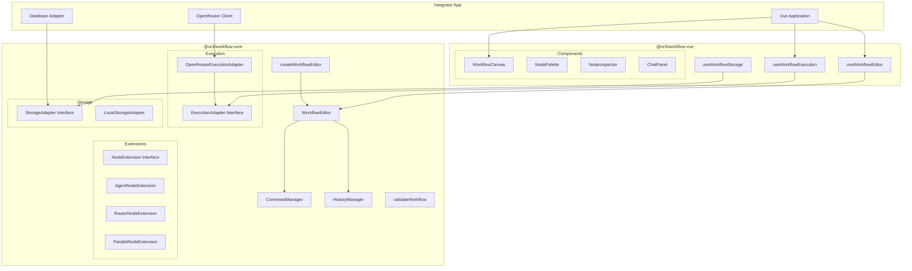

# or3-workflows SDK Lockdown - Technical Design

## Overview

This document describes the technical design for locking down the or3-workflows public API to create a clean, Tiptap-style SDK. The goal is to expose only the essential surface area while maintaining full functionality for integrators.

The design follows these principles:

1. **Minimal API surface** - Export only what integrators need
2. **Dependency injection** - Adapters accept external clients
3. **Interface-first** - Define contracts for extensibility
4. **Framework separation** - Keep core logic framework-agnostic

---

## Architecture

### High-Level Component Diagram



---

## 1. Core Package Exports (`@or3/workflow-core`)

### 1.1 New `index.ts` Structure

```typescript
// @or3/workflow-core/src/index.ts

// =============================================================================
// Types - Public API
// =============================================================================
export type {
    // Workflow structure
    WorkflowData,
    WorkflowNode,
    WorkflowEdge,

    // Node data types
    NodeData,
    StartNodeData,
    AgentNodeData,
    RouterNodeData,
    ParallelNodeData,
    ToolNodeData,

    // Execution types
    ExecutionInput,
    ExecutionResult,
    ExecutionCallbacks,
    ExecutionOptions,
    ChatMessage,
    NodeStatus,

    // Extension types
    Extension,
    NodeExtension,
    PortDefinition,

    // Validation types (re-exported from validation.ts)
    ValidationResult,
    ValidationError,
    ValidationWarning,

    // Storage types
    StorageAdapter,
    WorkflowSummary,
} from './types';

// =============================================================================
// Editor Factory
// =============================================================================
export { createWorkflowEditor } from './editor';
export type { EditorOptions, WorkflowEditor } from './editor';

// =============================================================================
// Validation
// =============================================================================
export { validateWorkflow } from './validation';

// =============================================================================
// Execution Adapters
// =============================================================================
export type { ExecutionAdapter } from './types';
export { OpenRouterExecutionAdapter } from './execution';

// =============================================================================
// Storage Adapters
// =============================================================================
export { LocalStorageAdapter } from './storage';

// =============================================================================
// Built-in Extensions
// =============================================================================
export {
    StartNodeExtension,
    AgentNodeExtension,
    RouterNodeExtension,
    ParallelNodeExtension,
    ToolNodeExtension,
} from './extensions';

// =============================================================================
// Schema Version (for migrations)
// =============================================================================
export { SCHEMA_VERSION } from './types';
```

### 1.2 `createWorkflowEditor` Factory Function

Add a factory function to `editor.ts`:

````typescript
// @or3/workflow-core/src/editor.ts

/**
 * Create a new WorkflowEditor instance.
 *
 * This is the recommended way to create an editor, as the factory
 * function provides a stable API even as the class implementation evolves.
 *
 * @example
 * ```typescript
 * import { createWorkflowEditor, AgentNodeExtension } from '@or3/workflow-core';
 *
 * const editor = createWorkflowEditor({
 *   extensions: [AgentNodeExtension],
 *   content: myWorkflowData,
 *   onUpdate: ({ editor }) => {
 *     console.log('Workflow changed:', editor.getJSON());
 *   },
 * });
 * ```
 */
export function createWorkflowEditor(
    options: EditorOptions = {}
): WorkflowEditor {
    return new WorkflowEditor(options);
}
````

### 1.3 Types Cleanup

Ensure `types.ts` has clear separation between public and internal types:

```typescript
// @or3/workflow-core/src/types.ts

// =============================================================================
// PUBLIC TYPES - Exported via index.ts
// =============================================================================

/** The main workflow document structure */
export interface WorkflowData {
    meta: WorkflowMeta;
    nodes: WorkflowNode[];
    edges: WorkflowEdge[];
}

// ... other public types ...

// =============================================================================
// INTERNAL TYPES - Not exported via index.ts
// =============================================================================

/** @internal Graph structure for workflow traversal */
interface WorkflowGraph {
    nodeMap: Map<string, WorkflowNode>;
    children: Record<string, Array<{ nodeId: string; handleId?: string }>>;
    parents: Record<string, string[]>;
}

/** @internal Internal execution state */
interface InternalExecutionContext {
    // ...
}
```

---

## 2. Vue Package Exports (`@or3/workflow-vue`)

### 2.1 New `index.ts` Structure

```typescript
// @or3/workflow-vue/src/index.ts

// =============================================================================
// Composables
// =============================================================================
export { useWorkflowEditor } from './composables/useEditor';
export { useWorkflowExecution } from './composables/useWorkflowExecution';
export { useWorkflowStorage } from './composables/useWorkflowStorage';
export { useExecutionState } from './composables/useExecutionState';

// =============================================================================
// Core Components
// =============================================================================
export { default as WorkflowCanvas } from './components/WorkflowCanvas.vue';
export { default as NodePalette } from './components/ui/NodePalette.vue';
export { default as NodeInspector } from './components/ui/NodeInspector.vue';
export { default as ChatPanel } from './components/ui/ChatPanel.vue';

// =============================================================================
// Optional UI Components
// =============================================================================
export { default as Controls } from './components/ui/Controls.vue';
export { default as MiniMap } from './components/ui/MiniMap.vue';
export { default as EdgeLabelEditor } from './components/ui/EdgeLabelEditor.vue';
export { default as ValidationOverlay } from './components/ui/ValidationOverlay.vue';

// =============================================================================
// Node Components (for custom rendering)
// =============================================================================
export { default as NodeWrapper } from './components/nodes/NodeWrapper.vue';

// =============================================================================
// Re-export core types for convenience
// =============================================================================
export type {
    WorkflowData,
    WorkflowNode,
    WorkflowEdge,
    NodeStatus,
    ExecutionResult,
    StorageAdapter,
    WorkflowSummary,
} from '@or3/workflow-core';
```

### 2.2 `useWorkflowEditor` Composable

Rename the existing `useEditor` to `useWorkflowEditor` for clarity:

````typescript
// @or3/workflow-vue/src/composables/useEditor.ts

import { shallowRef, onBeforeUnmount, markRaw, type ShallowRef } from 'vue';
import {
    createWorkflowEditor,
    type EditorOptions,
    type WorkflowEditor,
} from '@or3/workflow-core';

/**
 * Vue composable for managing a WorkflowEditor instance.
 *
 * Handles lifecycle management and ensures proper cleanup on unmount.
 *
 * @example
 * ```vue
 * <script setup>
 * import { useWorkflowEditor } from '@or3/workflow-vue';
 * import { AgentNodeExtension } from '@or3/workflow-core';
 *
 * const editor = useWorkflowEditor({
 *   extensions: [AgentNodeExtension],
 * });
 * </script>
 *
 * <template>
 *   <WorkflowCanvas :editor="editor" />
 * </template>
 * ```
 */
export function useWorkflowEditor(
    options: EditorOptions = {}
): ShallowRef<WorkflowEditor | null> {
    const editor = shallowRef<WorkflowEditor | null>(null);

    // Initialize editor
    const instance = createWorkflowEditor(options);
    editor.value = markRaw(instance);

    // Cleanup on unmount
    onBeforeUnmount(() => {
        editor.value?.destroy();
        editor.value = null;
    });

    return editor;
}

// Keep old name as alias for backward compatibility
export const useEditor = useWorkflowEditor;
````

### 2.3 `useWorkflowExecution` Composable

Create a new composable that wraps execution with Vue reactivity:

````typescript
// @or3/workflow-vue/src/composables/useWorkflowExecution.ts

import { ref, readonly, type Ref, type DeepReadonly } from 'vue';
import type {
    WorkflowData,
    ExecutionInput,
    ExecutionResult,
    ExecutionAdapter,
    ExecutionCallbacks,
    NodeStatus,
} from '@or3/workflow-core';

export interface WorkflowExecutionState {
    isRunning: boolean;
    streamingContent: string;
    nodeStatuses: Record<string, NodeStatus>;
    currentNodeId: string | null;
    error: Error | null;
    result: ExecutionResult | null;
}

export interface UseWorkflowExecutionReturn {
    /** Current execution state (readonly) */
    state: DeepReadonly<Ref<WorkflowExecutionState>>;

    /** Execute a workflow */
    execute: (
        adapter: ExecutionAdapter,
        workflow: WorkflowData,
        input: ExecutionInput
    ) => Promise<ExecutionResult>;

    /** Stop the current execution */
    stop: (adapter: ExecutionAdapter) => void;

    /** Reset the execution state */
    reset: () => void;
}

/**
 * Vue composable for managing workflow execution state.
 *
 * Provides reactive state that updates as nodes execute.
 *
 * @example
 * ```vue
 * <script setup>
 * import { useWorkflowExecution } from '@or3/workflow-vue';
 * import { OpenRouterExecutionAdapter } from '@or3/workflow-core';
 * import OpenRouter from '@openrouter/sdk';
 *
 * const { state, execute, stop, reset } = useWorkflowExecution();
 *
 * const client = new OpenRouter({ apiKey: 'your-key' });
 * const adapter = new OpenRouterExecutionAdapter(client);
 *
 * async function runWorkflow() {
 *   const result = await execute(adapter, workflow, { text: 'Hello' });
 *   console.log('Result:', result);
 * }
 * </script>
 * ```
 */
export function useWorkflowExecution(): UseWorkflowExecutionReturn {
    const state = ref<WorkflowExecutionState>({
        isRunning: false,
        streamingContent: '',
        nodeStatuses: {},
        currentNodeId: null,
        error: null,
        result: null,
    });

    const execute = async (
        adapter: ExecutionAdapter,
        workflow: WorkflowData,
        input: ExecutionInput
    ): Promise<ExecutionResult> => {
        // Reset state
        state.value = {
            isRunning: true,
            streamingContent: '',
            nodeStatuses: {},
            currentNodeId: null,
            error: null,
            result: null,
        };

        const callbacks: ExecutionCallbacks = {
            onNodeStart: (nodeId) => {
                state.value.currentNodeId = nodeId;
                state.value.nodeStatuses[nodeId] = 'active';
            },
            onNodeFinish: (nodeId, output) => {
                state.value.nodeStatuses[nodeId] = 'completed';
                if (state.value.currentNodeId === nodeId) {
                    state.value.currentNodeId = null;
                }
            },
            onNodeError: (nodeId, error) => {
                state.value.nodeStatuses[nodeId] = 'error';
                state.value.error = error;
            },
            onToken: (nodeId, token) => {
                state.value.streamingContent += token;
            },
        };

        try {
            const result = await adapter.execute(workflow, input, callbacks);
            state.value.result = result;
            state.value.isRunning = false;
            return result;
        } catch (error) {
            state.value.error = error as Error;
            state.value.isRunning = false;
            throw error;
        }
    };

    const stop = (adapter: ExecutionAdapter) => {
        adapter.stop();
        state.value.isRunning = false;
    };

    const reset = () => {
        state.value = {
            isRunning: false,
            streamingContent: '',
            nodeStatuses: {},
            currentNodeId: null,
            error: null,
            result: null,
        };
    };

    return {
        state: readonly(state),
        execute,
        stop,
        reset,
    };
}
````

### 2.4 `useWorkflowStorage` Composable

Create a storage composable that works with any `StorageAdapter`:

````typescript
// @or3/workflow-vue/src/composables/useWorkflowStorage.ts

import { ref, type Ref } from 'vue';
import type {
    WorkflowData,
    StorageAdapter,
    WorkflowSummary,
} from '@or3/workflow-core';

export interface UseWorkflowStorageReturn {
    /** List of saved workflows */
    workflows: Ref<WorkflowSummary[]>;

    /** Loading state */
    isLoading: Ref<boolean>;

    /** Last error */
    error: Ref<Error | null>;

    /** Load all workflows */
    loadList: () => Promise<void>;

    /** Load a specific workflow */
    load: (id: string) => Promise<WorkflowData>;

    /** Save a workflow */
    save: (workflow: WorkflowData) => Promise<string>;

    /** Delete a workflow */
    remove: (id: string) => Promise<void>;
}

/**
 * Vue composable for workflow persistence.
 *
 * Accepts any StorageAdapter implementation, allowing integrators
 * to use localStorage, a database, or any other backend.
 *
 * @example
 * ```vue
 * <script setup>
 * import { useWorkflowStorage } from '@or3/workflow-vue';
 * import { LocalStorageAdapter } from '@or3/workflow-core';
 *
 * const adapter = new LocalStorageAdapter();
 * const { workflows, load, save, remove } = useWorkflowStorage(adapter);
 *
 * // Or with a custom database adapter:
 * // const adapter = new MyDatabaseAdapter(supabaseClient);
 * // const { workflows, load, save } = useWorkflowStorage(adapter);
 * </script>
 * ```
 */
export function useWorkflowStorage(
    adapter: StorageAdapter
): UseWorkflowStorageReturn {
    const workflows = ref<WorkflowSummary[]>([]);
    const isLoading = ref(false);
    const error = ref<Error | null>(null);

    const loadList = async (): Promise<void> => {
        isLoading.value = true;
        error.value = null;
        try {
            workflows.value = await adapter.list();
        } catch (e) {
            error.value = e as Error;
            throw e;
        } finally {
            isLoading.value = false;
        }
    };

    const load = async (id: string): Promise<WorkflowData> => {
        isLoading.value = true;
        error.value = null;
        try {
            return await adapter.load(id);
        } catch (e) {
            error.value = e as Error;
            throw e;
        } finally {
            isLoading.value = false;
        }
    };

    const save = async (workflow: WorkflowData): Promise<string> => {
        isLoading.value = true;
        error.value = null;
        try {
            const id = await adapter.save(workflow);
            await loadList(); // Refresh the list
            return id;
        } catch (e) {
            error.value = e as Error;
            throw e;
        } finally {
            isLoading.value = false;
        }
    };

    const remove = async (id: string): Promise<void> => {
        isLoading.value = true;
        error.value = null;
        try {
            await adapter.delete(id);
            await loadList(); // Refresh the list
        } catch (e) {
            error.value = e as Error;
            throw e;
        } finally {
            isLoading.value = false;
        }
    };

    return {
        workflows,
        isLoading,
        error,
        loadList,
        load,
        save,
        remove,
    };
}
````

---

## 3. OpenRouter Client Injection

### 3.1 Refactored `OpenRouterExecutionAdapter`

The adapter already accepts an injected client. We need to ensure it uses only the SDK surface:

````typescript
// @or3/workflow-core/src/execution.ts

import type { OpenRouter } from '@openrouter/sdk';

/**
 * Execution adapter that uses the OpenRouter SDK for LLM calls.
 *
 * Requires an OpenRouter client instance to be injected at construction.
 * This allows integrators to configure API keys, headers, and middleware
 * on their own client instance.
 *
 * @example
 * ```typescript
 * import OpenRouter from '@openrouter/sdk';
 * import { OpenRouterExecutionAdapter } from '@or3/workflow-core';
 *
 * const client = new OpenRouter({
 *   apiKey: process.env.OPENROUTER_API_KEY,
 *   defaultHeaders: {
 *     'X-Custom-Header': 'value',
 *   },
 * });
 *
 * const adapter = new OpenRouterExecutionAdapter(client, {
 *   defaultModel: 'anthropic/claude-3.5-sonnet',
 * });
 * ```
 */
export class OpenRouterExecutionAdapter implements ExecutionAdapter {
    private client: OpenRouter;
    private options: ExecutionOptions;
    private abortController: AbortController | null = null;
    private running = false;

    constructor(client: OpenRouter, options: ExecutionOptions = {}) {
        if (!client) {
            throw new Error(
                'OpenRouterExecutionAdapter requires an OpenRouter client instance'
            );
        }
        this.client = client;
        this.options = {
            defaultModel: 'openai/gpt-4o-mini',
            maxRetries: 2,
            retryDelayMs: 1000,
            ...options,
        };
    }

    // ... rest of implementation uses this.client.chat.completions.create()
}
````

### 3.2 Remove Direct Fetch Usage

Audit the execution.ts file to ensure:

-   No direct `fetch()` calls for API requests
-   Model capabilities are fetched via SDK if available, or cached
-   Error handling uses SDK error types

Current implementation already uses `this.client.chat.completions.create()` which is correct.

---

## 4. Demo Application (`demo-v2`)

### 4.1 Current State

The `demo-v2` directory already contains a full-featured demo application with:

-   `useWorkflowExecution` composable (399 lines) - handles workflow execution with streaming
-   `useWorkflowStorage` composable - handles localStorage persistence
-   `useWorkflowValidation` composable - workflow validation
-   Full UI with canvas, palette, inspector, and chat

### 4.2 Migration Strategy

Rather than building a new example app, we will:

1. **Move composables to `@or3/workflow-vue`** - Extract and refactor the demo composables into the package
2. **Update demo-v2 imports** - Have demo-v2 import from `@or3/workflow-vue` instead of local files
3. **Keep demo-v2 as reference** - It serves as both the development playground and integration example

### 4.3 Composable Refactoring

The demo's `useWorkflowExecution` has demo-specific logic mixed with reusable logic. We will:

```typescript
// @or3/workflow-vue - Generic, reusable
export function useWorkflowExecution() {
    // Reactive state management
    // Callback wiring to update state
    // Returns: { state, execute, stop, reset }
}

// demo-v2 - App-specific
// Uses the package composable + adds chat message handling,
// conversation history, UI-specific concerns
```

### 4.4 Demo as Integration Example

After refactoring, demo-v2 will demonstrate:

```vue
<script setup lang="ts">
// Import from packages (locked down API)
import {
    LocalStorageAdapter,
    OpenRouterExecutionAdapter,
} from '@or3/workflow-core';
import {
    WorkflowCanvas,
    NodePalette,
    NodeInspector,
    ChatPanel,
    useWorkflowEditor,
    useWorkflowExecution,
    useWorkflowStorage,
} from '@or3/workflow-vue';
import OpenRouter from '@openrouter/sdk';

// Integrator creates their own OpenRouter client
const client = new OpenRouter({ apiKey: userApiKey.value });

// Inject client into execution adapter
const executionAdapter = new OpenRouterExecutionAdapter(client);

// Use package composables
const editor = useWorkflowEditor();
const { state, execute } = useWorkflowExecution();
const storage = useWorkflowStorage(new LocalStorageAdapter());
</script>
```

### 4.5 Custom Storage Adapter Example

For integrators who want database-backed storage, the `StorageAdapter` interface is simple:

```typescript
import type {
    StorageAdapter,
    WorkflowData,
    WorkflowSummary,
} from '@or3/workflow-core';

class SupabaseStorageAdapter implements StorageAdapter {
    constructor(private supabase: SupabaseClient) {}

    async load(id: string): Promise<WorkflowData> {
        const { data } = await this.supabase
            .from('workflows')
            .select('*')
            .eq('id', id)
            .single();
        return data;
    }

    async save(workflow: WorkflowData): Promise<string> {
        const { data } = await this.supabase
            .from('workflows')
            .upsert(workflow)
            .select('id')
            .single();
        return data.id;
    }

    async delete(id: string): Promise<void> {
        await this.supabase.from('workflows').delete().eq('id', id);
    }

    async list(): Promise<WorkflowSummary[]> {
        const { data } = await this.supabase
            .from('workflows')
            .select('id, name, created_at, updated_at');
        return data;
    }

    export(workflow: WorkflowData): string {
        return JSON.stringify(workflow, null, 2);
    }

    import(json: string): WorkflowData {
        return JSON.parse(json);
    }
}
```

---

## 5. Testing Strategy

### 5.1 Unit Tests

-   Test `createWorkflowEditor` factory returns valid editor instance
-   Test `OpenRouterExecutionAdapter` constructor validates client
-   Test `LocalStorageAdapter` CRUD operations
-   Test `validateWorkflow` catches all error conditions

### 5.2 Integration Tests

-   Test `useWorkflowEditor` cleanup on unmount
-   Test `useWorkflowExecution` state updates during execution
-   Test `useWorkflowStorage` with mock adapter

### 5.3 Demo App Validation

-   Verify demo-v2 builds and runs with new package imports
-   Verify workflows can be created, saved, loaded
-   Verify execution works with API key

---

## 6. Migration Notes

### 6.1 Breaking Changes

1. **Import paths change** - Integrators must update imports to use explicit exports
2. **`useEditor` renamed** - Now `useWorkflowEditor` (alias provided for backward compat)
3. **`OpenRouterExecutionAdapter` constructor** - Now requires client as first argument

### 6.2 Backward Compatibility

-   Keep `useEditor` as alias for `useWorkflowEditor`
-   Keep `WorkflowEditor` class export (but prefer factory)
-   Maintain existing component props
